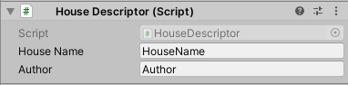

# Gorilla Homes Mod Project
Unity project version 2019.3.15
Join the discord to learn how to make homes: https://discord.gg/FdqFUvJZ5m

OPEN SCENE BASESCENE TO SEE TREE

- House Name : Name your house
- Author : Put your name here

To make a home simply put all of your models inside the House Gameobject 

and then go to window click exporter

Then name and export your house

You should then see this just click YIPEE (Thanks mono lol)

Now in the project window navigate to HomeOutput

in there you should see a file called whatever you named your home
drag this file into your home folder in the Gorilla Tag Folder

Then you are finished load up gorilla tag and your house should be on the house switcher

